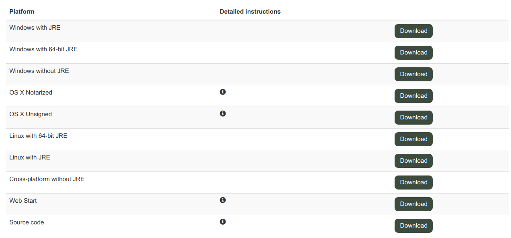
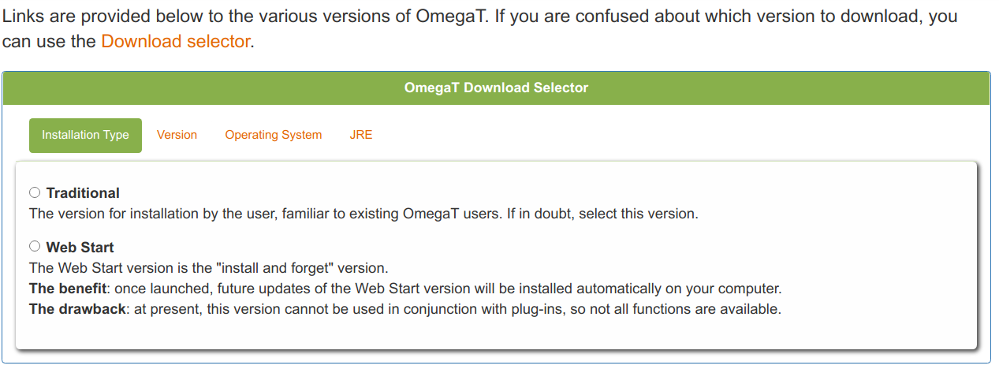

# OmegaT for CAT Beginners

###### tags: `OmegaT`, `Translation`, `Tutorial`

by Susan Welsh, Marc Prior and Hiroshi Miura

---

## Copyright

Copyright (c) 2014 Susan Welsh & Mark Prior  \
Copyright (c) 2020 Hiroshi Miura

Permission is granted to copy, distribute and/or modify this document under the terms of the GNU Free Documentation License,
Version 1.3 or any later version published by the Free Software Foundation; with no Invariant Sections,
no Front-Cover Texts, and no Back-Cover Texts. A copy of the license is included in the section
entitled "GNU Free Document License".

Cover illustration is from www.freeclipartnow.com, in the public domain.

Last update: August 2020  \
Refer to OmegaT version: 5.4.0

Screenshots from OmegaT version 5.4.0 on Windows 10 Enterprise(Build 19041)

Please note that owing to the pace at which OmegaT is being developed, the appearance of the screenshots and possibly
some other information may have changed slightly.

# Preface

This tutorial consists of ***Chapter 1. Introduction*** to ***Chapter 7. OmegaT users' group***. A tutorial is intended to read from the beginning to end, step by step, and then tried out.
When you reach ***Chapter 7. OmegaT users' group***, all the basics are done.

# 1. Introduction

## 1.1. Intended readership

This document is intended for translators who are not experienced with Computer Assisted Translation (CAT) tools, and discusses only the basics.
Another useful source of information is ***[OmegaT website - Documentation](https://omegat.org/en/documentation)***.

## 1.2. What is a CAT tool and why is it useful?

A CAT tool, as the term is generally used by translators, refers to a computer program
that creates a “translation memory” (TM) of a translated document, which can then be used to facilitate
the translation of future documents that have significant similarity to the first.
This aspect makes it especially useful for repetitive material. Also:

- A glossary function allows the user to enter source words and their translations into a glossary, which can be accessed while translating.

- A search function scans previously translated material (either in a document in the present project, or in a translation memory from a previous project), so that the user can see how a word or a phrase was previously translated.

- A segmentation function displays one “segment” of source text at a time (usually a sentence), and the translation is done with the target text on the screen directly below the source text. This is very useful for 1) making sure you don’t skip text; 2) checking your work; and 3) displaying both source and target text in a font and size that are comfortable for you.

CAT tools allow for greater consistency of translation, including when more than one translator is working on a job.
Finally, CAT tools reproduce the formatting of the source document. CAT tools range in price from free (OmegaT)
to $2,500 or more. OmegaT is an excellent place to start, as the price is right, it is relatively easy to learn,
and it runs on Macintosh computers and under Linux, as well as Windows.

OmegaT supports the current Microsoft Office file formats (.docx, .xlsx, .pptx). It does not support
the older Microsoft Office file formats (.doc, .xls, .ppt); these must first be converted,
e.g. to the current Microsoft Office file formats.

See the following entries for more information on CAT tools, including on the many varieties available:

- [Wikipedia - Computer-assisted Translation](https://en.wikipedia.org/wiki/Computer-assisted_translation)
- [Wikipedia - Translation Memory](https://en.wikipedia.org/wiki/Translation_memory)

# 2. Downloading OmegaT

Download OmegaT (the OmegaT site tells you the various options; ***“standard”*** versions are main stream, well tested, well documented and widely used, and recommend to use for production projects. ***“latest”*** versions are stable,
but may have a bug or two and do not have up-to-date documentation).

[OmegaT download page](https://omegat.org/download)

The on-screen download instructions should be self-explanatory. It is advisable to choose a version that
includes Java Runtime Environment (JRE) in your download.
For the purposes of this tutorial, we assume that you will be using a Windows operating system.
If you are using another system, or want to use on some custom environment, you can try "Download selector" that propose best version for you.

If you have a doubt, and run into problems, the OmegaT Users' group can help you (see Step 7).

# 3. Installing OmegaT

When/after downloading the OmegaT zip file, place it in a suitable folder, e.g. for Windows,  C:\Program Files.
Unpack (extract, unzip) the zip archive.
After downloading OmegaT (Windows version), launch the program's executable .exe file and follow the on-screen instructions,
which should be self-explanatory.

# 4. The OmegaT user interface

After launching OmegaT, the main OmegaT window should appear with three main panes: the Editing pane,
the Fuzzy Matches pane, and the Glossary pane; and five optional panes: Machine Translation,
Multiple Translations, Notes, Comments, and Dictionary. The optional panes are covered
in the comprehensive User’s Manual.

If you can’t see all the main panes, drag the borders between them across your screen
until they are arranged approximately as shown below.
The Editing pane displays the “Instant Start” tutorial in English.
The User’s Manual can be called up with the “Help” menu item or F1.

If the Editing pane is empty, the language of your Windows installation is probably not English and OmegaT
does not have an ***Instant Start tutorial*** written in your language. In this case, call up the OmegaT documentation
by selecting Help > User’s Manual, or by pressing F1.

Be warned that the documentation may be a little out of date, owing to the pace at which OmegaT is being developed.
For some languages, it is quite out of date. Volunteers to translate the current documentation are welcome!
Please contact the users' group.

## 4.1. Installing a spelling dictionary

You will need a place to store one or many of your dictionaries for your target language’s spellchecker
(this is not the place for bilingual dictionaries). An example is to create a “dictionaries” folder
in your Program Files (Start > My Computer >  Local Disk (C:) > Program Files > right-click > New Folder,
name it “dictionaries.”)
Then from the OmegaT menu, click Options > Spell checking. Click Choose and navigate to the “dictionaries”
folder (screenshot, ***a***, below).

Click “Install new dictionary” and you will be given a list of many possible dictionaries (***b***).
(If nothing happens, select a different repository – see [OmegaT Howto - Spellchecking](https://omegat.org/en/howtos/spelling.html))
Click on the one or ones you want and click Install again, then close the box. Selecting a dictionary
and “Install” causes the relevant dictionary to be downloaded from the Internet to the folder
which you specified in **a**). Of course, you must be connected to the Internet for this function to work.
You will see that the dictionary or dictionaries appear listed in the “spellchecker setup” dialog window ***c***).
Make sure the language variant of your dictionary matches the language variant of your target language,
or the spellchecker will not work properly (e.g. British English or American English).

  \
***a)*** Spellchecker setup screen

  \
***b)*** Spellchecker dictionary installer screen

  \
***c)*** Spellchecker setup screen indicate dictionary installed

# 5. Creating a project

Most CAT tools use the term ***“project”*** to refer to a collection of folders and files associated with a translation.
A ***“project”*** is usually synonymous with a translation job.
To create a project in OmegaT, select Project, then click New. The “Create a New Project” dialog appears (not shown here).
Navigate to a suitable folder in which to create the project, e.g. the main folder you use for your translations,
or you can place it on the Desktop for temporary ease of access, and later move it to ***My Documents*** folder
or a similar location for storage.

Enter a suitable name for your project, such as the client’s name and purchase order number, and click Save.
For purposes of this tutorial, let’s call it ***My Project-1***.

The ***“Create New Project”*** dialog appears.
Select the desired source and target languages by clicking on the arrows to the right of these fields.

Click on ***“Segmentation”*** to call up the ***Segmentation Setup*** dialog. OmegaT is supplied with a number
of very basic segmentation patterns. Pick the one for the language of your source text (e.g., Italian, “IT.*”),
and use ***“Move Up”*** to move it to the top of the list. If the language of your source text isn’t listed,
pick a language that is, double-click on the ***Language Name*** field, and change it to the abbreviation
for your language.
Do the same with the ***Language Pattern*** field.
If you use OmegaT for any length of time in the future, you will want to customize the segmentation rules.
It is not worth getting bogged down with fine-tuning the segmentation rules at this stage; the basic rules,
as supplied, should work adequately for demonstration purposes, even for a different (source) language,
provided its sentence punctuation rules are broadly similar (i.e. don’t use the Japanese segmentation
rules if you are translating from Italian).

Confirm the segmentation rules and then creation of the project with OK. ***Do not change any other settings,
for the purposes of this tutorial. Do not click on “Browse” or otherwise change the default locations of
the project folders (directories).*** You have now created an empty project.

The Project Files window is displayed, which is empty since your project does not yet contain any files.
(Do not use the “Import Source Files” function during this exercise; you can experiment with it later, on your own.)
You can close this window.

Find your project in your file manager: it is a folder with the name of the project, containing the subfolders
***/dictionary, /glossary, /omegat, /source, /target***, and ***/tm***.
They are all empty. You will put your document to be translated into the ***/source*** folder;
the ***/target*** folder will be filled with your translated text; the ***/omegat***  folder need not concern you now;
the ***/tm*** and ***/glossary*** folders will remain empty unless, and until, you create a .tmx file and a glossary and
put them into those respective folders; the ***/dictionary*** folder is where you can put bilingual dictionaries,
if you wish, in the appropriate format (see User’s Manual).

# 6. Translating

We provide here two projects for self-training.

The first, to get you started, uses a simple MS Word file in the source language. This does not
demonstrate OmegaT’s full capabilities, but is intended to help the novices grasp
the most essential procedures. The second project uses an HTML file or set of files,
downloaded from the Internet, and demonstrates OmegaT’s capability to deal with graphics,
complex layout, and complex file structure. There you will learn how translation memories, glossaries,
and the search function work. These capabilities can be used regardless of the file
type (.docx, .xlsx, .odt, .txt, .html, etc.).
See ***6.B.1-6.B.4***, below. We ignore these in Project 1 only for training purposes.
***Please proceed to Project 2 after completing Project 1!***

Important: the purpose of this introduction to OmegaT is to acquaint you with the basic concepts
of translation memory software. References to OmegaT’s more advanced or obscure functions have been deliberately omitted or kept to a minimum, since a description of them would almost certainly lead to you,
as a new user, being unable to see the forest for the trees. Consult the User’s Manual for further information.

## 6.A. Project 1: A simple MS Word file

Launch LibreOffice Writer and create a new text document. Then use ***File > Open*** to Choose open any short MS Word (.docx format) document in the source language. It should include at least some formatting, such as title, subheads, font changes. (For the purposes of this tutorial, you may use ***.docx*** files according to this procedure, although in fact .docx files do not require the mediation of LibreOffice Writer. See User‘s Manual when you are ready for the fine points.) In LibreOffice, select the menu ***File > Save As***, name the file, and close it in ***.odt*** format. Click and drag the newly created .odt file to the ***/source*** folder of your ***My Project-1*** folder, which you created in Step **5**.

You can find [an example .odt file](https://raw.githubusercontent.com/miurahr/omegat-for-cat-beginners/master/files/demo.odt) and [.docx file](https://raw.githubusercontent.com/miurahr/omegat-for-cat-beginners/master/files/demo.docx) at GitHub repository of the tutorial for your convenience.

Launch OmegaT and click ***Project > Open***. Navigate to ***My Project-1*** (it will have the OmegaT icon beside it). Double-click on the file. The Project Files dialog will display your source document. Close the dialog box. Your translation file is now displayed in the Editing pane, and you can begin translating.

The basic idea is that the text is presented to you one segment at a time. A segment normally corresponds to one sentence. You type your translation into the field provided, confirm by hitting ***Enter***, and so on. OmegaT is an “inline” translation memory application, meaning that you see only one copy of the text; segments which have already been translated appear as such, otherwise the untranslated source text is displayed. Only in the case of the “active” segment, which is highlighted, are both source text and translation displayed.
By default, the source text is pasted into the target text segment for you. This is convenient with heavily tagged (formatted) text, since it is easier to retain the tags undamaged by simply replacing the text between them. With less heavily tagged text, you can delete the content of the target text field and simply type in the translation, or you can instruct OmegaT to leave it blank by default (refer to the User’s Manual for details).

### 6.A.2. Handling tags

Handling tags takes some practice. The general principle is that you translate the text between tags and leave the tags untouched. For example, this text in English:

> Look at ***that***!

might appear like this in OmegaT:

> Look at <a0>that</a0>!

and be translated like this in OmegaT into German:

> Schau dir <a0>das</a0> an!

which then appears like this in the final text:

> Schau dir **das** an!

In this case, <a0> and </a0> are the opening and closing tags for bold text respectively.
“<a0>“ and “</a0>“ do not necessarily indicate the beginning and end of bold text, however;
if the word “that” were in italics in the source text rather than bold, the tags would
be the same. Only by looking at the source text can you ascertain the actual function of
the tags in a particular case.

The current Microsoft Office file formats (.docx, .xlsx, .pptx) can generate
numerous unnecessary tags, making translation cumbersome. One solution
to this problem is [Codezapper](http://asap-traduction.com/CodeZapper), which can eliminate
these, while keeping the tags you actually need; or you can use the Remove Tags feature of
OmegaT itself to remove all tags. See the User’s Manual (F1).

Until you are familiar with tag handling, it is best to retain all the tags and to keep them
in the same order if at all possible. OmegaT does allow you to delete tags and to change their
order, but only if certain rules are carefully followed. Otherwise, you may risk corrupting
your final document and preventing it from being opened.
For details of the tag handling rules, refer to the User’s Manual.

## 6.A.3. Checking your translation

Eventually, you will reach the end of the file you are translating. If your project contains
more than one file for translation, confirming the last segment in the first file will take
you to the topmost segment in the second file.

An advantage probably common to all translation memory applications is that they simplify
checking: once you have completed the first draft of your translation, you can “walk” through
it with the source and target versions of each sentence displayed next to each other. In the
case of OmegaT, the source is displayed above the target text of the active segment,
facilitating comparison:

### 6.A.4. Validating tags, creating target documents

After you have checked and saved your translation, newer versions of OmegaT
will check automatically that you have not damaged any tags during the translation
process, or you can do it manually yourself: ***Tools > Validate Tags***.
Note: Damaged or missing tags in XML file formats, such as LibreOffice, are likely
to result in the output file failing to open at all.

Create the target documents by selecting ***Project > Create Translated Documents***.
The translated documents are automatically generated in their original format
in the ***/target*** folder. If your project consists of multiple source files,
possibly in multiple subfolders and with accompanying graphics files, etc.,
as is the case with the examples in our second, HTML, project, the entire
structure of the files in ***/source*** is reproduced in ***/target***.

### 6.A.5. Final checking, correction, and delivery

If you prefer to check your translation on paper, print out the target document.
Don’t, however, make corrections in the LibreOffice Writer or MS Word file: find
the relevant segments in OmegaT (using the text search function,
to be discussed below, Step 6.B.4) and make them there.

After revising the text and making any corrections, create the translated documents
again and close the project.
You are now ready to deliver the job. If the client requires MS Office format,
simply save the target file in LibreOffice in the relevant MS format (.doc, etc.)

## Project 2: An HTML document

### 6.B.1. Downloading the supplementary materials

Launch OmegaT and create a new project. Let’s call it ***My Project-2***. Set it up just as you did with ***My Project-1***
in Step ***5***.
The procedures described in ***Project 1***, Steps ***6.A.1-6.A.4***, all apply here too, for HTML files.

All files selected for translation in this tutorial are from OmegaT documentation; some documents comprise more than one file, include graphics,
to familiarize you with OmegaT's usefulness for such structured documents.

Now, Let's start ***My Project-2*** for OmegaT webpage localization. At first, download the files from [the Internet, OmegaT's top page](https://omegat.org/), navigating so that they go directly into the ***/source*** folder of My Project-2. Make sure you download the entire webpage, including graphics.
(Various browsers have slightly different methods for doing this. Chrome browser, for example, select Save As > Webpage, Complete from context menu shown by clicking the mouse's right button; for Microsoft Edge browser, there is no easy way to do so.)

Your ***/source*** folder will now contain one or more HTML file(s), together with associated files such as graphics files. The structure of folders and subfolders must be retained. You should be able to open the HTML files in your browser and view them approximately as they appear on the Internet.

You can [download zipped OmegaT's website top page](https://raw.githubusercontent.com/miurahr/omegat-for-cat-beginners/master/files/omt_website.zip)
from the tutorial site in the case you cannot find a way to download, for example you use MS Edge browser, or just for your convenience.
If you download the zip file, save it in temporary directory, and then extract all files into ***/source*** directory with keeping directory structure.

Next, download the “legacy tmx file” which we have created for the training in various languages at:

Target language(EN->)| legacy TMX file
---------------------|-----------------
Belarusian           | [be.tmx](https://raw.githubusercontent.com/miurahr/omegat-for-cat-beginners/master/files/be.tmx)
Catala               | [ca.tmx](https://raw.githubusercontent.com/miurahr/omegat-for-cat-beginners/master/files/ca.tmx)
Dutch                | [nl.tmx](https://raw.githubusercontent.com/miurahr/omegat-for-cat-beginners/master/files/nl.tmx)
French               | [fr.tmx](https://raw.githubusercontent.com/miurahr/omegat-for-cat-beginners/master/files/fr.tmx)
German               | [de.tmx](https://raw.githubusercontent.com/miurahr/omegat-for-cat-beginners/master/files/de.tmx)
Greek                | [el.tmx](https://raw.githubusercontent.com/miurahr/omegat-for-cat-beginners/master/files/el.tmx)
Suomi                | [fi.tmx](https://raw.githubusercontent.com/miurahr/omegat-for-cat-beginners/master/files/fi.tmx)
Bahasa Indonesia     | [id.tmx](https://raw.githubusercontent.com/miurahr/omegat-for-cat-beginners/master/files/id.tmx)
Japanese             | [ja.tmx](https://raw.githubusercontent.com/miurahr/omegat-for-cat-beginners/master/files/ja.tmx)
Polish               | [pl.tmx](https://raw.githubusercontent.com/miurahr/omegat-for-cat-beginners/master/files/pl.tmx)
Portuguese           | [pt.tmx](https://raw.githubusercontent.com/miurahr/omegat-for-cat-beginners/master/files/pt.tmx)
Russian              | [ru.tmx](https://raw.githubusercontent.com/miurahr/omegat-for-cat-beginners/master/files/ru.tmx)
Simplified Chinese   |[zh_CN.tmx](https://raw.githubusercontent.com/miurahr/omegat-for-cat-beginners/master/files/zh_CN.tmx)
Spanish              | [es.tmx](https://raw.githubusercontent.com/miurahr/omegat-for-cat-beginners/master/files/es.tmx)
Svenska              | [sv.tmx](https://raw.githubusercontent.com/miurahr/omegat-for-cat-beginners/master/files/sv.tmx)
Taiwanese Chinese    | [zh_TW.tmx](https://raw.githubusercontent.com/miurahr/omegat-for-cat-beginners/master/files/zh_TW.tmx)

Then copy the .tmx file of your target language to the ***/tm*** folder of your project.

And place ["glossary.txt"](https://raw.githubusercontent.com/miurahr/omegat-for-cat-beginners/master/files/glossary.txt) file, which define "OmegaT" is as "OmegaT", to ***/glossary*** folder of your project.

Now it is ready to start!

### 6.B.2. Translation memory (fuzzy match function)

Eventually, you will encounter fuzzy matches. Normally, it may be some time before you encounter
useful fuzzy matches, but the “legacy” translation memory file has been provided for you
in this tutorial to ensure that you will find at least some.

“Fuzzy matches” are segments with some degree of similarity to the segment you are translating.
They may be within the current project (either in the text you are currently translating or,
where a project comprises more than one source text, in another text within the same project),
or they may be in the legacy .tmx file(s) which you placed in the ***/tm*** folder. Since the legacy .tmx files
in the ***/tm*** folder are the product of previous translation jobs, you will not normally have
any useful legacy .tmx files to call upon until you have completed a few jobs in OmegaT,
and placed them into the ***/tm*** folder of your new job.

Here, the current segment shows a fuzzy match with a segment elsewhere in
the project that has already been translated:

If after looking at the fuzzy match you decide that it is useful, you can paste it into the active
segment at any point (Ctrl+I), or replace (overwrite) the active segment with it completely (Ctrl+R)
and then modify it, or copy and paste parts of it into the active segment (Ctrl+C and Ctrl+V to copy and paste).

### 6.B.3. The text search (find) function

Ctrl+F calls up a search dialog with which you can search for any term throughout the project,
i.e. within the source text and the legacy translation memory files, source segments,
target segments, and glossary files.

As with the glossary function, you can use keyboard shortcuts to copy and paste content
from the Text Search window into the active translation segment.
If you wish to change the text in a segment within the current project which is displayed
in the Text Search window, double-click on it and OmegaT will take you to the segment concerned.

The Text Search window has quite powerful search functions. For details, see the User’s Manual.
Note that there is no automatic “global replace” function available as a “scripting” plugin outside
the main program is also described in the User’s Manual. But there are “workarounds” that can be used.

### 6.B.4. Handing of HTML tags

Some more points to note about the HTML files for translation:

- If you view these files in your browser on your PC, they will differ slightly in appearance from the pages on the Internet. This has nothing to do with OmegaT or your browser, but is due to the fact that Wikipedia does not allow all the template information for its pages to be downloaded.

- When you are translating from HTML, you will see a lot of codes that do not need to be translated, particularly at the beginning of each file. In many cases, whole segments (“sentences”), such as web links, can be left as they are. Simply click through these by pressing Enter to confirm that the target is to remain the same.

 - HTML is generally very tolerant of corrupted or missing tags; the result is likely to be a file which will open, but with unexpected or undesired formatting results. Review Step ***6.A.1*** on handling tags.

 - With heavily tagged HTML text, you may find it convenient to keep the source text open at the same time and to toggle between the two programs (Alt+tab) in order to be able to see more quickly what text actually has to be translated. As a general rule for the purpose of this tutorial, assume that if something is visible in your browser, it should be translated.

The windows in the above screenshot have been reduced in size in order to show the idea of keeping OmegaT and the source text (in your browser) open at the same time(To be replaced: current a case of Wikipedia).

- When you are finished and ready to check your work, you can open the translated files in ***/target*** in your browser and read through them, and/or print them out for checking. If you prefer to read through the finished text on the screen, i.e. in your browser, toggle between the browser and OmegaT. When you find errors in the text in the browser window, make the corresponding changes within OmegaT.

The legacy material provided for the purpose of this tutorial is intended to demonstrate the functions of OmegaT.
Under no circumstances should the translations in the translation memory be assumed to be reliable.
With heavily tagged text, you are likely to find that OmegaT yields numerous spurious fuzzy matches
in which only the tags are identical, and which are not therefore useful.

### 6.B.5. The glossary function

Glossary files are simply plain-text files containing two or three columns of terms delimited by tabs(aka. TSV: Tab Separated Value file) which can be easily created by Office applications' export function.
(See User’s Manual for how to set up a glossary.)

OmegaT creates an empty default glossary file for a project when the project is first created.
You can also add further glossary files of your own. For the purpose of this project, a glossary (.txt) file
has been created for you for each language combination. This file will be of limited
practical help to you during translation, but it serves to show you how the glossary
terms are displayed to you in OmegaT when they occur: immediately in the OmegaT glossary pane.
Terms and their translations will appear when you reach a segment containing them.

Wild card characters are not accepted. Do not put an article before the noun in a glossary;
if you want to indicate the gender of the noun, put that after the first tab in the glossary,
in the column where you put the translation. Thus, if your source document contains the words ***ein Mensch***,
a glossary that has the source text as ***der Mensch*** will not find it; use ***Mensch*** for the glossary instead.
For more on glossaries, including adding new terms, consult the User’s Manual.

# 7. The OmegaT users' group

OmegaT has a friendly, helpful, and multilingual user group. Once you have joined, you can post questions there regarding OmegaT,
which is a [recommended support channel](https://sourceforge.net/projects/omegat/lists/omegat-users). To join, simply “Sign Up” using your e-mail.

- [Sign-Up page](https://sourceforge.net/projects/omegat/lists/omegat-users)

OmegaT is also present on several Social Network Sites (SNS).

- [Facebook](https://www.facebook.com/OmegaTOfficial)
- [Twitter](https://twitter.com/OmegaTOfficial)
- [Telegram](https://telegram.me/joinchat/IswSVw9XMwz0J-w9aoz5iA)
