# CATビギナーのためのOmegaT入門

###### tags: `OmegaT`, `Translation`, `Tutorial`

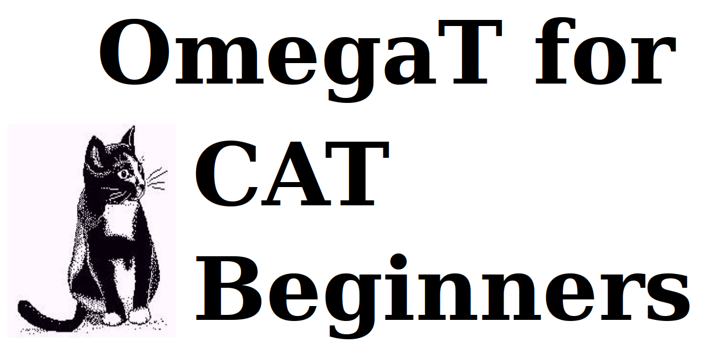

by Susan Welsh, Marc Prior and Hiroshi Miura \
Japanese translation by Hiroshi Miura

---

# 著作権表示

Copyright (c) 2014 Susan Welsh & Mark Prior  \
Copyright (c) 2020 Hiroshi Miura

Permission is granted to copy, distribute and/or modify this document under the terms of the GNU Free Documentation License, Version 1.2 or any later version published by the Free Software Foundation; with no Invariant Sections, no Front-Cover Texts, and no Back-Cover Texts. A copy of the license is included in the section entitled "GNU Free Document License."

カバーのイラストは、www.freeclipartnow.com 由来で、パブリックドメイン のものです。

最終更新：2020年9月  \
オリジナル更新日：2014年3月  \
参照しているOmegaTバーション: 5.3.0

OmegaT 5.3.0のスクリーンショットを利用  \
開発の進展に伴って、画面や、その他の情報が本書から変わる場合があります。

# はじめに

このチュートリアルは、***第1章はじめに***から***第7章OmegaTユーザグループ***までで構成されています。 本チュートリアルは、最初から終わりまでステップごとに、手をうごかして試行しながら読みすすめることを前提にして記述されています。本チュートリアルを最後まで完了したならば、OmegaTの基本については全て身についたといえるようになります。

# 1. はじめに

## 1.1. 想定読者

CAT(コンピュータ支援翻訳：Computer Assisted Translation)ツールの経験の少ない翻訳者を対象として、本書ではその基礎だけを説明しています。
他の有用な情報源を得るには、 [ドキュメント](https://omegat.org/en/documentation) へアクセスしてください。

## 1.2. CATツールとは何か、何故有用なのか？

CATツールとは、一般に翻訳者が使用するソフトウェアのことで、特に、翻訳されたドキュメントの「翻訳メモリ」(Translation Memory:TM )を作成するプログラムのことを指しています。翻訳メモリによって、以前の文章と非常によく似ている将来の文書の翻訳を容易にすることができます。バージョンアップなどの反復的な作業の場合に、この点が特に有用です。さらに、

- 用語集機能を使用すれば、ユーザは原語と訳語を登録しておき、翻訳中に参照できるようになります。

- 検索機能は、以前に翻訳された文書(現在のプロジェクトのドキュメント、または以前のプロジェクトの翻訳メモリ)をスキャンして、ユーザが単語またはフレーズが、以前にどのように翻訳されたかを確認できるようになります。

- セグメンテーション機能は、一度に1つの原文テキストの「セグメント」を表示します(通常は文です)。原文のすぐ下の画面に訳文を入力することで、翻訳がすすんでいきます。これは 1)文章の翻訳忘れを防止; 2) 作業結果の確認 3) 原文と訳文に自分が作業しやすいフォントを選べる、 というメリットがあります。

CATツールにより、1人の翻訳者が仕事をしている場合すら凌ぐ、翻訳の一貫性の向上をもたらします。
最後に、CATツールはソース文書のフォーマットを再現します。CATツールの価格は、無料(OmegaT)から2,500ドル以上まで幅があります。OmegaTは、価格が適正で、比較的学習しやすく、MACとLinuxとWindowsで動作するため、出発点としては最適です。

OmegaTは、現在のMicrosoft Officeファイル形式(.docx、.xlsx、.pptx)をサポートしています。古いMicrosoft Officeファイル形式(.doc、.xls、.ppt)はサポートされていません。これらのファイル形式は、最新のMicrosoft Officeファイル形式に変換する必要があります。

様々なツールの紹介をふくめ、CATツールの詳細については[Wikipedia記事:翻訳支援ツール](https://ja.wikipedia.org/wiki/%E7%BF%BB%E8%A8%B3%E6%94%AF%E6%8F%B4%E3%83%84%E3%83%BC%E3%83%AB)や[Wikipedia記事:翻訳メモリ](https://ja.wikipedia.org/wiki/%E7%BF%BB%E8%A8%B3%E3%83%A1%E3%83%A2%E3%83%AA)を参照してください。

# 2. OmegaTのダウンロード

まず、OmegaTをダウンロードしてください(OmegaTのサイトには様々なオプションが記載されています。(「ベータ」バージョンは安定していますが、1つか2つのバグがある場合があり、最新のドキュメントはありません)。

[OmegaT ダウンロードページ](https://omegat.org/download)

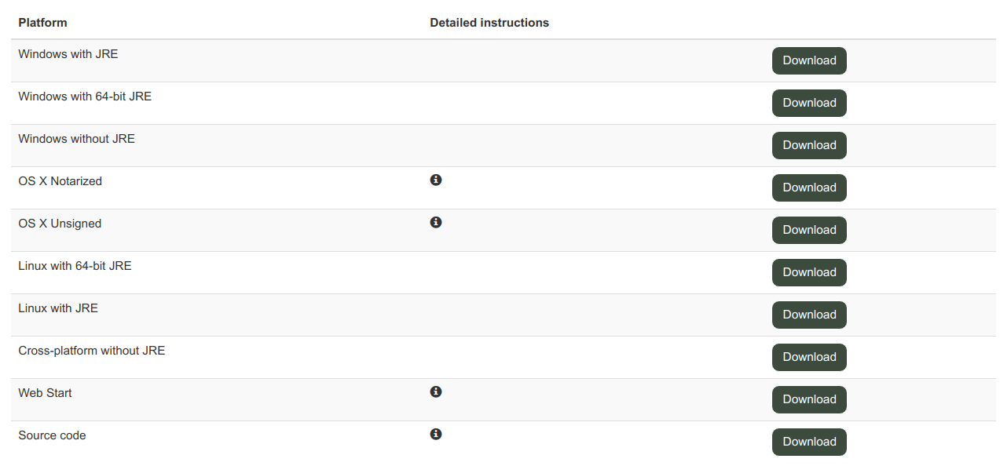

画面の表示されているダウンロードの手順には、説明が必要です。ダウンロードにJava(JRE)を含むバージョンを選択することをお勧めします。このチュートリアルでは、Windowsオペレーティングシステムを使用することを前提としています。もし、ほかのシステムを使っている場合や、問題に遭遇してしまったならば、OmegaTユーザグループへ質問してみてください(第7章参照)。

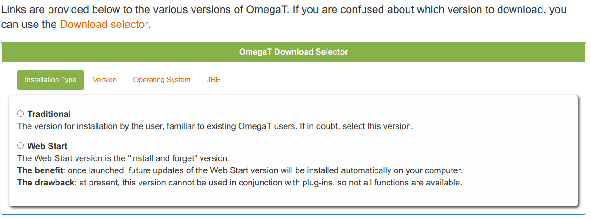

zipファイルをダウンロードしたら、Windowsの場合は<s0/>C:\Program Filesなどの適切なフォルダに保存します。
OmegaT(Windowsバージョン)をダウンロードしたら、exeファイルを起動し、画面に表示される説明に従って操作します。

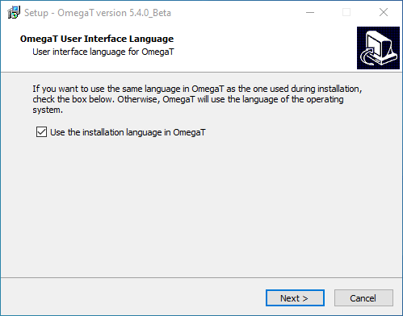

# 4. OmegaTユーザーインターフェイス

OmegaTを起動すると、OmegaTのメインウィンドウが開き、編集ペイン、ファジーマッチペイン、用語集ペインの3つのメインペインと、機械翻訳、複数訳文、 メモ、コメント、辞書の5つのオプションペインが表示されます。オプションのペインについては、『ユーザーズマニュアル』を参照してください。

すべてのメインペインが表示されない場合は、下図のように配置されるまで、ペイン間の境界をドラッグします。
[編集]ペインに「クイックスタート」チュートリアルがOSの言語で表示されます。
ユーザーズマニュアルは、「Help」メニュー項目またはF1で呼び出すことができます。

[編集]ウィンドウが空の場合は、インストールされているWindowsの言語が英語ではない可能性があります。またOmegaTに、使用している言語のサポートが無いようです。この場合は、[Help]>[User's Manual]を選択するか、[F1]を押してOmegaTのマニュアルを呼び出します。

OmegaTが開発されているペースが速いため、ドキュメントが少し時代遅れになっている可能性があることに注意してください。
言語によっては、マニュアルがとても古い可能性があります。最新のドキュメントを翻訳してくれるボランティアを歓迎します。
Please contact the users' group.

## 4.1. スペルチェック辞書をインストールする

訳文言語のスペルチェック用の辞書を保存する場所が必要です(二言語辞典の場所では<f0>ありません</f0>)。たとえば、プログラムファイルに「dictionaries」フォルダを作成します([スタート]>[マイコンピュータ]>[<s1/>ローカルディスク(C:)]>[Program Files]>右クリック>[新規フォルダ]「dictionaries」という名前を付けます)。[OmegaT]メニューから、[設定>[艦橋設定]>[スペルチェッカー]をクリックします。「参照」をクリックし、「dictionaries」フォルダに移動します(スクリーンショット(下記<f2>a</f2>参照)。

<f5>「新しい辞書を組み込み」をクリックすると、リストが表示されます(</f5><f6>b</f6><f7>)。
(何も起こらない場合は、別のリポジトリを選択します。</f7><t8/><a9><f10>www.omegat.org/en/howto/spelling.html</f10></a9><f11>.</f11><f12>を参照)</f12>必要なリポジトリをクリックし、もう一度[インストール]をクリックして、ボックスを閉じます。辞書を選択して[インストール]を実行すると、<f13>a)</f13>で指定したフォルダに、該当する辞書がインターネットからダウンロードされます。もちろん、この機能が動作するためにはインターネット接続が必要です。
辞書または「スペルチェッカーの設定」ダイアログウィンドウに辞書の一覧が表示されます。
ここで、辞書の言語種別と、ターゲット言語が一致していることを確認してください。辞書やスペルチェッカーは、言語種別が一致しない場合には、動作しません。(例：米国英語と英国英語)

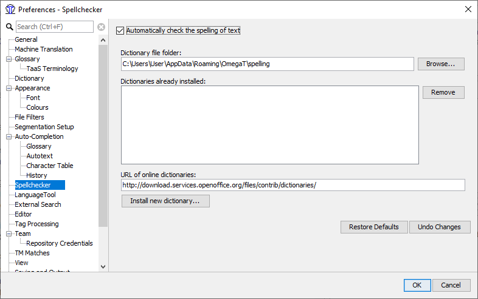
***a)*** Spellchecker setup screen

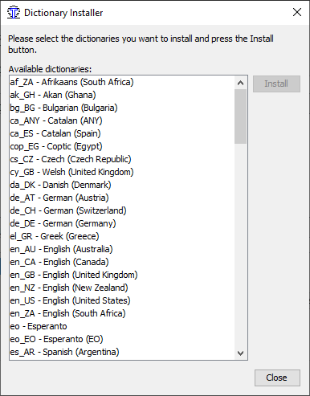
***b)*** Spellchecker dictionary installer screen

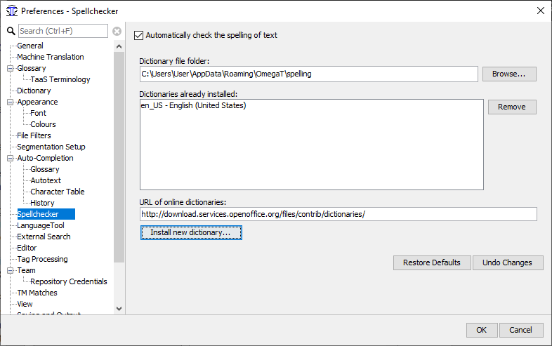
***c)*** Spellchecker setup screen indicate dictionary installed

# 5. 新規プロジェクトの作成

ほとんどのCATツールでは、翻訳に関連付けられたフォルダとファイルの集まりを「プロジェクト」と呼びます。
「プロジェクト」は通常、翻訳作業を意味しています。
OmegaTでプロジェクトを作成するには、[プロジェクト]を選択し、[新規作成]をクリックします。[新規プロジェクト]ダイアログが表示されます(ここには表示されていません)。
翻訳に使用するメインのフォルダなど、プロジェクトを作成するのに適したフォルダにナビゲートします。または、一時的にアクセスしやすいようにデスクトップに配置し、後でマイドキュメントなどの保存場所に移動することもできます。

顧客の名前や発注件名など、プロジェクトに適した名前を入力して、[保存]をクリックします。
このチュートリアルでは、これを***マイプロジェクト-1***と呼ぶことにします。

[新規プロジェクトの作成]ダイアログが表示されます。
これらのフィールドの右側にある矢印をクリックして、目的のソース言語とターゲット言語を選択します。

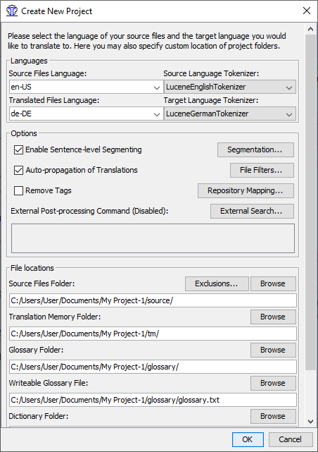

[文節化規則]をクリックして、[文節化規則設定]ダイアログを呼び出します。OmegaTには、非常に基本的な文節化のパターンがいくつか用意されています。原文の言語(例:イタリア語、"IT.*")と選択し、"上へ移動"ボタンをつかってリストの先頭に移動します。原文の言語が一覧にない場合は「言語名]フィールドをダブルクリックして言語の省略形に変換します。
[Language<t4/>Pattern]フィールドも同様に操作します。
今後、OmegaTを長期間使用するようになると、文節化規則をカスタマイズしたくなるかもしれません。
この段階でセグメンテーション規則を微調整する必要はありません。提供されている基本的な規則は、その文の句読点の規則が広く似ている(つまり、イタリア語から翻訳する場合は日本語のセグメンテーション規則を使用しない)場合には、別の(ソース)言語であっても、デモ用に十分に機能するはずです。

セグメント化規則を確認し、「OK」をクリックしてプロジェクトを作成します。***このチュートリアルでは、他の設定は変更しないでください。[参照]をクリックしたり、プロジェクトフォルダ(ディレクトリ)の既定の場所を変更したりしないでください。***これで、空のプロジェクトが作成されました。

[プロジェクトファイル]ウィンドウが表示されます。このウィンドウは、ファイルがまだ含まれていないプロジェクトのため空です。
(「ソースファイルのインポート」機能は使用しないでください。後で自分で試すことができます)。
このウィンドウを閉じます。

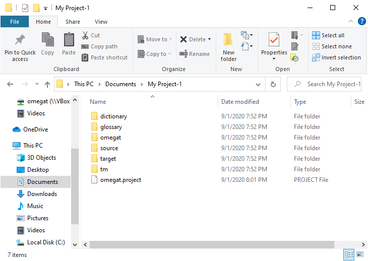

ファイルマネージャでプロジェクトを検索します。プロジェクトフォルダには、***/dictionary、/glossary、/omegat、/source,
/target***、***/tm***があることがわかります。
すべて空です。翻訳対象の文書は、***/source***フォルダに配置します。***/target***フォルダには、翻訳された文書が出力されます。***/omegat***フォルダはここでは関係ありません。***/tm***および***/glossary***ファイルには、自身でtmxファイルや用語集を造っている場合以外は関係ありません。***/dictionary***フォルダには、必要に応じて適切なフォーマット(ユーザーズ・マニュアルを参照)の辞書をコピーします。

# 6. 翻訳作業

ここでは、自己トレーニングのための2つのプロジェクトを提供します。

1つ目は、原文に単純なMS Wordファイルを使用する方法です。これはOmegaTの完全な能力を示すものではないのですがが、「初心者」が基本的な手順を把握できるようにしています。2番目のプロジェクトは、インターネットからダウンロードしたHTMLファイルや、複数のHTMLファイルを使って、OmegaTの複雑なレイアウトと<s1/>複雑なファイル構造を再現できる、グラフィック処理能力をデモンストレーションします。ここでは翻訳メモリ、用語集、検索機能の仕組みについて説明します。これらの機能は、ファイルの種類(.docx、.xlsx、.odt、.txt、.htmlなど)によらず利用できます。
See ***6.B.1-6.B.4***, below. トレーニングが目的なので、プロジェクト1ではこれらを無視します。
***Project 1の完了後、プロジェクト2に進んでください。***

重要:このOmegaT入門の目的は翻訳メモリソフトウェアの基本概念を学ぶことです。OmegaTのより高度で不明瞭な機能が意図的に省略するか、最小限の説明にとどめています。
これらの記述があると確実に、新しいユーザにとって、木を見て森を見ることができない状態になってしまいます。詳細はユーザーマニュアルを参照してください。

## 6.A. プロジェクト1:単純なMS Wordファイル

LibreOffice Writerを起動し、新しいテキストドキュメントを作成します。次に ファイル>開く で、原文言語の任意の小さなMS Word文書(.docx形式)を選択します。タイトル、小見出し、フォントの変更など、少なくともいくつかのフォーマットを含める必要があります。(このチュートリアルの目的のために、この手順で.docxファイルを利用しますが、実際的には、LibreOffice Writerの仲介は必要ありません。ある程度理解したら『ユーザーズマニュアル』を参照してください。)
ファイル > 名前を付けて保存  を選択し、ファイルに名前を付けて.odt形式で保存します。新たに作成した.odtファイルをクリックして選択し、ドラッグして、**ステップ5**で作成した***マイプロジェクト-1***のフォルダの***/source*** フォルダへコピーします。

You can find [an example .odt file](files/demo.odt) and [.docx file](files/demo.docx) at GitHub repository of the tutorial for your convenience.

OmegaTを起動し、「プロジェクト」>「開く」をクリックします。「My Project-1」に移動します(横にOmegaTアイコンが表示されています)。ファイルをダブルクリックします。プロジェクトファイル ダイアログにソースドキュメントが表示されます。ダイアログボックスを閉じます。翻訳ファイルが編集ペインに表示され、翻訳を開始できます。

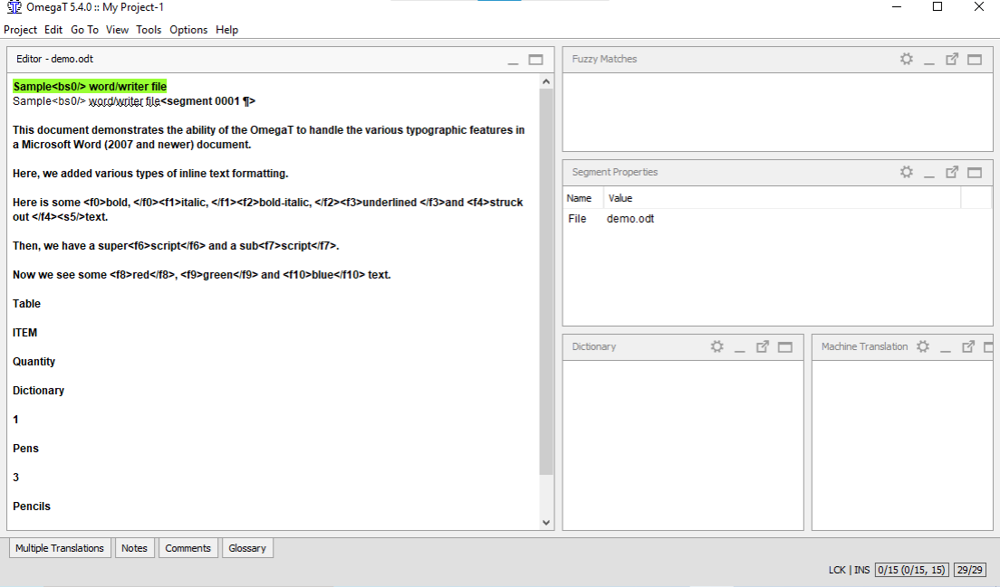

基本的には、テキストは一度に1セグメントずつ表示されます。通常、セグメントは1つの文に対応します。表示されたフィールドをクリックし、訳文を入力して、Enterキーを押して確定します。OmegaTは「インライン」翻訳メモリアプリケーションです。つまり、テキスト部分のコピーだけが見えます。
すでに翻訳されているセグメントはそのまま表示されます。そうでなければ、翻訳されていない原文が表示されます。「アクティブ」な強調表示されているセグメントは、原文と訳文の両方が表示されます。
既定では、原文が訳文セグメントに貼り付けられています。タグ間のテキストを置き換えるだけでタグは損傷しないため、大量にタグ付けされた(書式設定された)テキストでとても便利です。
訳文フィールドの内容を削除し翻訳文を入力するか、空白のままにすることで、デフォルト動作をOmegaTに指示できます。(詳細はユーザーズマニュアルを参照)

### 6.A.2. タグの処理

タグの処理には、ある程度の練習が必要です。一般的な原則は、タグ間のテキストを翻訳し、タグはそのままにします。たとえば、この英語のテキストの場合：

> Look at ***that***!

は、OmegaTでは、このようにみえます:

> Look at <a0>that</a0>!

OmegaTで日本語に翻訳してください

> Schau dir <a0>das</a0> an!

最終的には次のように表示されます。

> Schau dir **das** an!

この場合、 <a0> と </a0> は、それぞれ太字テキストの開始タグと終了タグです。
「“<a0>」と「</a0>」は必ずしも太字の開始と終了を示す記号ではありません。もし、「that」という語が原文でイタリック体であった場合
おなじタグが、太字ではなく、イタリック体であることを示すタグになります。ソーステキストで見ることでのみ、特定ケースでのタグの実際の機能を確認できます。

現在のマイクロソフト Officeのファイルフォーマット (.docx, .xlsx, .pptx)は、大量の不要なタグが生成されてしまうため、翻訳が煩雑になります。一つの解決方法は、 [Codezapper](http://asap-traduction.com/CodeZapper)を利用することで、必要なタグを保持したまま、これらの不要タグの削除ができます。OmegaTの「全てのタグを削除」機能を利用することで全てのタグを削除することもできます。ユーザーマニュアル(F1)参照。

タグの処理に慣れるまでは、すべてのタグを保持し、できるだけ同じ順序にしてください。OmegaTは、タグを削除し、その順序を変更します。ただし、特定のルールに慎重に従っている場合に限ります。そうしないと、最終的なドキュメントが破損し、開かなくなる可能性があります。
タグ処理ルールの詳細については、ユーザーズマニュアルを参照してください。

## 6.A.3. 翻訳の確認

さて、翻訳するファイルの最終行まで作業がおわりました。プロジェクトに変換用のファイルが複数ある場合は、最初のファイルの最終セグメントを確認すると、2番目のファイルの最初のセグメントに移動します。

すべての翻訳メモリアプリケーションに共通する利点は、チェックが簡単になることです。最初の翻訳ドラフトが完成したら、原文バージョンと訳文バージョンを並行して表示して、ウオークスルーレビューをおこないます。OmegaTの場合は、有効化されたセグメントについて、原文が訳文の上に表示されているので、比較が簡単です：

### 6.A.4. タグの検証、訳文文書の作成

翻訳をチェックして保存すると、OmegaTは自動的にタグが破損していないことを確認します。[ツール]>[検証]を選択して、手動でプロセスを実行することもできます。
注:次のようなXMLファイル形式のタグが破損または欠落しています。
OpenOffice.orgでは、出力ファイルを開くことができなくなる可能性があります。

プロジェクトドキュメントを作成するには、「プロジェクト」>「訳文を生成する」を選択して、訳文ファイルを作成します。
翻訳されたドキュメントは/targetフォルダ内に元のフォーマットで生成されます。プロジェクトが複数の原文ファイルや、場合によっては複数のサブフォルダ、および付随するグラフィックファイルで構成されている場合は、
2番目のHTMLプロジェクトの例のように、***/source***内のファイルの構造は ***/target***内に複製されます。

### 6.A.5. 最終確認・修正・納品

翻訳を紙で確認する場合は、目的の文書を印刷します。
ただし、Open Office WriterまたはMS Wordファイルを修正しないでください。(後述の手順6.B.4で説明するテキスト検索機能を使用して)OmegaTで該当するセグメントを検索し、そこでセグメントを作成します。

テキストを修正して修正したら、翻訳済みドキュメントを再度作成し、プロジェクトを閉じます。
これで、ジョブを実行する準備ができました。クライアントでMS Office形式が必要な場合は、目的のファイルをLibreOfficeの該当するMS形式(.docなど)で保存します。

## プロジェクト2:HTMLドキュメント

### 6.B.1. 補足資料のダウンロード

OmegaTを起動し、新しいプロジェクトを作成します。これを***My Project-2***と呼びます。Step***5***の***My Project-1***と同様に設定します。
***プロジェクト1***のステップ***6.A.1-6.A.***で説明した手順は、HTMLファイルにも適用されます。

このチュートリアルで翻訳対象として選択したすべてのファイルはWikipediaからのものです。プロジェクトによっては、このような構造化文書に対するOmegaTの有用性を理解するために、複数のファイルで構成されているものもあります。

それでは、OmegaTのWebページのローカリゼーションについて、***My Project-2***を開始します。まず、OmegaTのトップページである[インターネット](https://omegat.org/)からファイルをダウンロードし、My Project-2の ***/source***フォルダに直接移動します。グラフィックスを含む Web ページ全体がダウンロードされていることを確認してください。
(これを行うための方法は、ブラウザーによって多少異なります。たとえば、Chromeブラウザでは、マウスの右ボタンをクリックして表示されるコンテキストメニューから[Save As]>[Webpage]、[Complete]を選択します。Microsoft Edgeブラウザでは、これを行う簡単な方法はありません。)

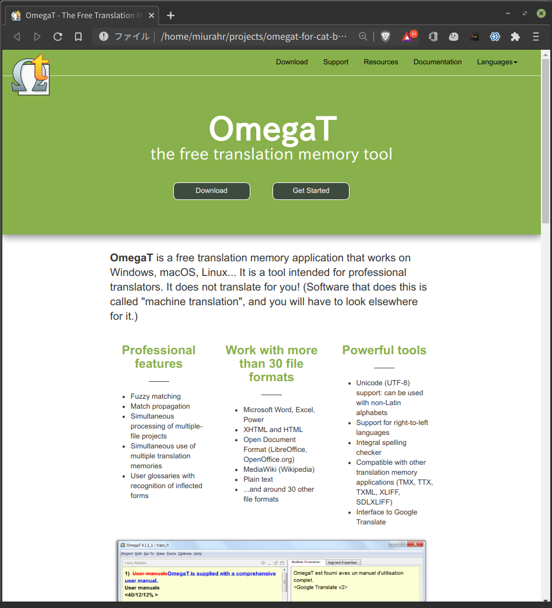

***/source***フォルダには、1つまたは複数のHTMLファイルと、グラフィックスファイルなどの関連ファイルが含まれます。フォルダとサブフォルダの構造は保持する必要があります。ブラウザでHTMLファイルを開き、インターネット上に表示されているのとほぼ同じ状態で表示できるはずです。

ダウンロードする方法が見つからない場合 ( MS Edge ブラウザーなど ) 、または便宜のため、 ](https://raw.githubusercontent.com/miurahr/omegat-for-cat-beginners/master/files/omt_website.zip)zip されたOmegaTの Web サイトのトップ・ページを ダウンロード[できます。
zip ファイルをダウンロードする場合は、一時ディレクトリーに保存してから、ディレクトリー構造を保持して、すべてのファイルを ***/source*** ディレクトリーに解凍します。

次に、このチュートリアルで使用するために作成した「レガシーパッケージ」をダウンロードします。

| ターゲット言語(EN→) | レガシー TMX ファイル |
---------------------|-----------------
| 簡体字中国語 | [zh_CN.tmx](files/zh_CN.tmx) |
| フランス語 | [fr.tmx](files/fr.tmx) |
| ドイツ語 | [de.tmx](files/de.tmx) |
| スペイン語 | [es.tmx](files/es.tmx) |
| ロシア語 | [ru.tmx](files/ru.tmx) |
| ベラルーシ語 | [be.tmx](files/be.tmx) |
| ギリシャ語 | [el.tmx](files/el.tmx) |
| オランダ語 | [nl.tmx](files/nl.tmx) |
| 日本語 | [ja.tmx](files/ja.tmx) |
| ポルトガル語 | [pt.tmx](files/pt.tmx) |
| ポーランド語 | [pl.tmx](files/pl.tmx) |
次に、 .tmx ファイルをプロジェクトの ***/tm*** フォルダーにコピーします。

これで準備完了です。

### 6.B.2. 翻訳メモリ(ファジーマッチ機能)

最終的には、ファジーマッチに遭遇します。通常、有用なファジーマッチを目撃するまでにそれなりの作業時間が必要です。このチュートリアルでは、少しでも体験できるように、「レガシー」翻訳メモリファイルを提供しています。

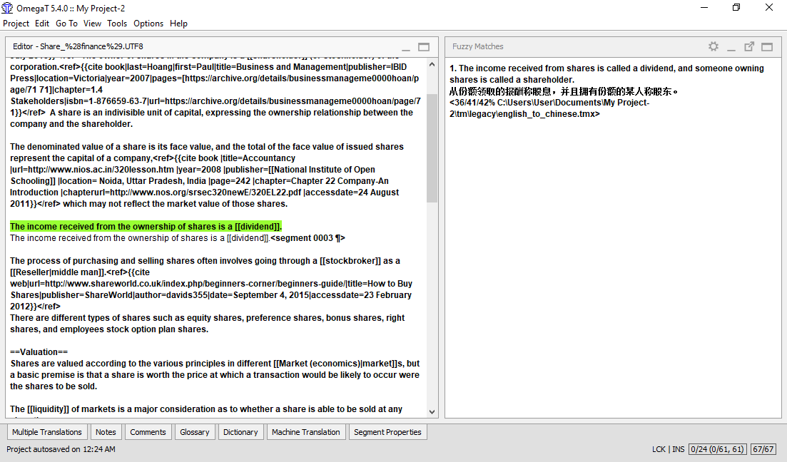

「ファジーマッチ」は、ある程度の類似性を持つ過去に翻訳した文節です。
これらは、現在のプロジェクト内(翻訳中のテキスト内、またはプロジェクトが複数のソーステキストで構成されている場合は、同じプロジェクト内の別のテキスト内)にあることもあれば、***/tm***フォルダに配置した .tmxファイル内にあることもあります。***/tm*** フォルダー内のレガシー .tmx ファイルは、以前の変換ジョブの結果であるため、 OmegaTでのいくつかのジョブを完了するまでは、通常は有用なレガシー .tmx ファイルを呼び出し、新規ジョブの ***/tm*** フォルダーに配置することはできません。

ここで、現在の文節は、既に翻訳されているプロジェクトのどこかの文節とのファジーマッチを表示したものです。

ファジーマッチを確認した後で、それが有用であると判断した場合は、任意の時点でアクティブセグメントに貼り付けるか(Ctrl+I)、アクティブセグメントを完全に置き換え(上書き)てから(Ctrl+R)修正するか、またはその一部をコピーしてアクティブセグメントに貼り付けます(Ctrl+CおよびCtrl+Vでコピーして貼り付けます)。

### 6.B.3. テキスト検索(検索)機能

[Ctrl]+[F]を押すと、任意の用語を検索できる検索ダイアログボックスが表示されます。プロジェクト全体を通して検索できます。つまり原文ファイルとレガシー翻訳メモリファイルを含んだ原文文節と訳文文節、および用語集ファイルです。

用語集の機能と同様に、コピーと貼りつけのキーボードショートカットを使用して、[テキスト検索]ウィンドウの内容をアクティブな翻訳文節に貼り付けることが出来ます。
[テキスト検索]ウィンドウに表示されている現在のプロジェクト内のセグメント内のテキストを変更する場合は、そのセグメントをダブルクリックすると、[OmegaT]で該当するセグメントに移動します。

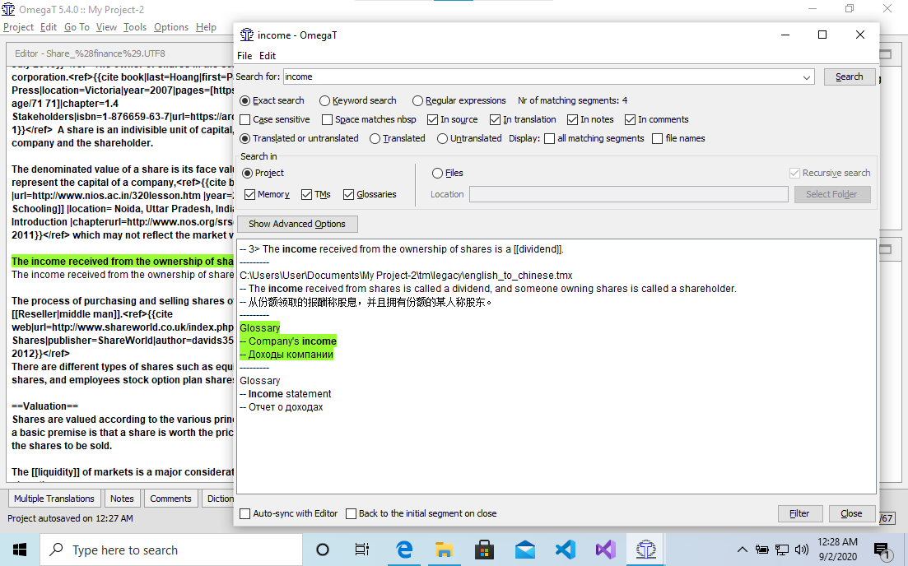

[テキスト検索]ウィンドウには、非常に強力な検索機能があります。詳細については、ユーザーズ・マニュアルを参照してください。
外部の「スクリプト」プラグインとして使用できる自動「グローバル置換」機能はありません。
取扱説明書にも記載されています。しかし、使用できる「回避策」があります。

### 6.B.4. HTMLタグの取り扱い

翻訳用のHTMLファイルについて、さらに注意すべき点があります。

- これらのファイルをPCのブラウザで表示するとインターネットのページみえかたと、わずかに異って見えます。OmegaTにも、ブラウザにも出来ることはありません。Wikipediaでは、ページのテンプレート情報はいずれもダウンロードを許可していないことに起因しています。

- HTMLから翻訳しているときには、特に各ファイルの先頭にあるコードは、翻訳する必要がありません。多くの場合、webリンクなどの文節("文")セグメントの全体は、そのままにします。それらの文節をクリックしたら、訳文は変えないことを確認して、[Enter]を押して次へすすみます。

- HTMLは通常、タグの破損や欠落に対して非常に寛容です。予期しないまたは望ましくないフォーマットの結果のファイルを開くことができる可能性が高いです。タグの処理に関する手順***6.A.1***を確認します。

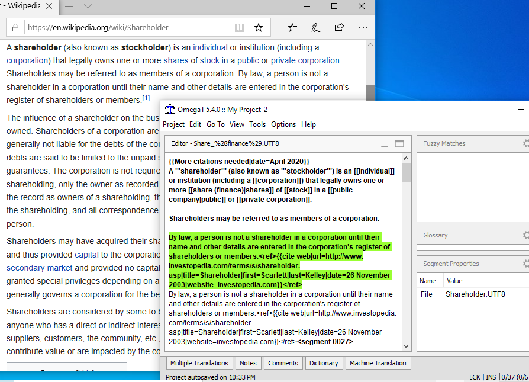

- 多数のタグ付けされたHTMLテキストでは、ソーステキストを同時に開き、[Alt]+[Tab])を押して、二つのテキストの実際の内容をすばやく確認しながら、どの文章が翻訳されたのかを確認すると便利です。このチュートリアルでは、ブラウザに何かが表示されている場合は、それを翻訳することにします。

上のスクリーンショットでは、OmegaTと(ブラウザ上の)原文を同時に見えるよう、ウインドウのサイズを小さくしています。

- 作業が完了し、作業を確認する準備が整ったら、翻訳されたファイルをブラウザーで ***/target*** に開き、それらのファイルを読み、それらを確認のために印刷するか、あるいはその両方を実行します。作業完了した訳文をスクリーン(つまりブラウザ)で読み通したいときは、ブラウザとOmegaTを切り変えながら見るといいでしょう。ブラウザウィンドウのテキストにエラーがある場合は、OmegaT内の対応する変更を修正します。

このチュートリアルで使用する従来の資料は、OmegaTの機能を示すことを目的としています。
どのような状況においても、翻訳メモリ内の翻訳結果を信頼できるものと仮定しないでください。
多くのタグが付いたテキストでは、OmegaTは、タグのみが同一であり、したがって役に立たない多数の誤ったファジーマッチを生成します。

### 6.B.5. 用語集機能

用語集ファイルは、タブで区切られた2列または3列の用語を含むプレーンテキストファイルです。
(用語集の設定方法については、ユーザーズマニュアルを参照してください)。

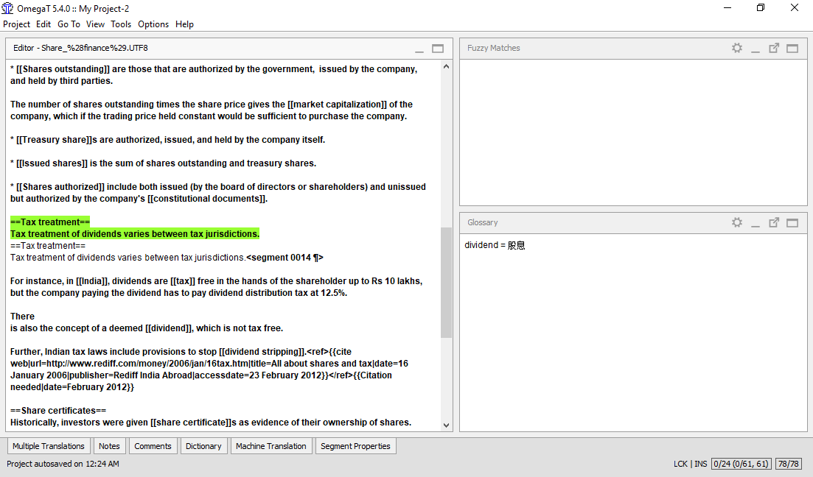

<f0>OmegaTでは、プロジェクトを最初に作成するときに、プロジェクト用の空の既定の用語集ファイルが作成されます。
独自の用語集ファイルをさらに追加することもできます。For the purpose of this project, a glossary (.txt) file
has been created for you for each language combination. This file will be of limited
practical help to you during translation, but it serves to show you how the glossary
terms are displayed to you in OmegaT when they occur: immediately in the OmegaT glossary pane.
用語とその翻訳は、それらを含むセグメントに到達すると表示されます。

ワイルドカード文字は使用できません。Do not put an article before the noun in a glossary;
if you want to indicate the gender of the noun, put that after the first tab in the glossary,
in the column where you put the translation. Thus, if your source document contains the words ***ein Mensch***,
a glossary that has the source text as ***der Mensch*** will not find it; use ***Mensch*** for the glossary instead.
新しい用語の追加など、用語集の詳細についてはユーザーズマニュアルを参照してください。

# 7. OmegaTユーザー・グループ

OmegaTには親切で役に立つマルチ言語のユーザーグループがある。参加すると、 OmegaTに関する質問を投稿することができます。これは [推奨されるサポート・チャネル](https://sourceforge.net/projects/omegat/lists/omegat-users)です。参加するには、電子メールを使用して「サインイン」するだけです。

OmegaTはまた、ソーシャルネットワークサイト(SNS)にもグループがあります。

- [Facebook](https://www.facebook.com/OmegaTOfficial)
- [Twitter](https://twitter.com/OmegaTOfficial)
- [Telegram](https://telegram.me/joinchat/IswSVw9XMwz0J-w9aoz5iA)
